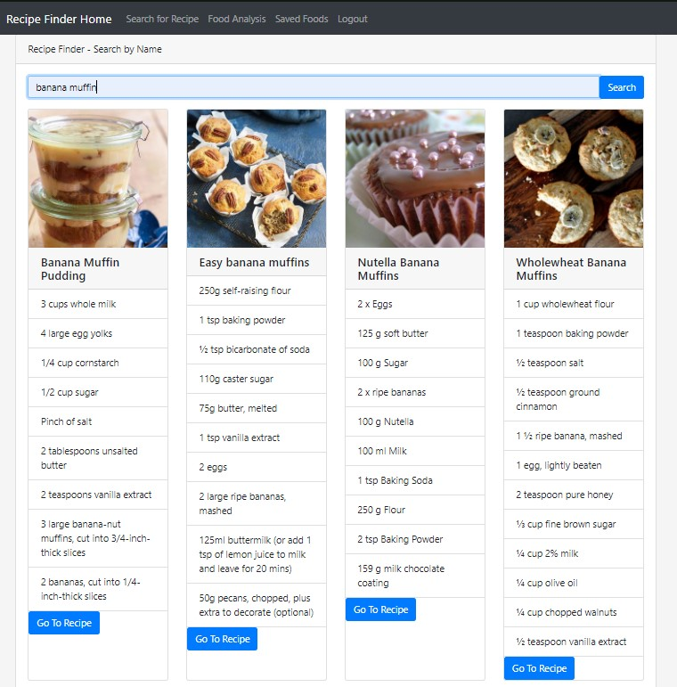
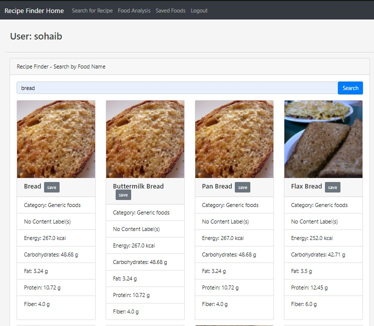
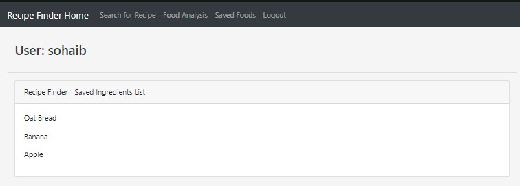

# Recipe Finder
### Author: Sohaib Mohiuddin

## Introduction
This application is a 3-in-1 application that provides the ability to find recipes with natural language, find nutrition information on any food available within the API used, login and use the application to save recipes (Work in progress) and considering the nature of this application, the user's connection is encrypted as well. 

## Features

### Back-End
- Database: Amazon RDS
	- Amazon RDS was used to host the tables required to run the web application without the use of local databases provided by heroku. RDS also hosts the tables that save the user and user saved ingredients list. 
- Deployment: Heroku / Localhost
- API: Edamam API
- Encryption: Python

### Front-End
- Recipe Finder: This feature allows the user to search Edamam's API for recipes. Edamam currently has over 1 million recipes and also supports natural language searching. Any previous searches you have in the search bar will appear as suggestions for future searches to save time. 
- Nutrition Analysis: This feature allows the user to search for any food and retreive nutrition values related to the food such as Energy, Carbs, Fat, Protein, and Iron. This also shows what category the food falls into.
- Save Foods: This is a work in progress feature that allows the user to save foods found in the Nutrition Analysis search. This would allow the user to view the foods and nutrition values on the go without searching for the food again because the list pertains to the logged in user. 
- Login/Register: A Login and Register feature has been provided for the user to create an account to use the application. Currently, the authentication allows the user to log in via an encrypted authentication. 

## Usage
- Go to: [Recipe Finder app](https://recipesearchdjangoapp.herokuapp.com/)

## Screenshots

